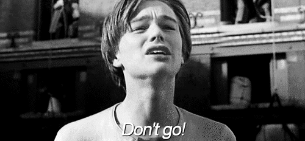
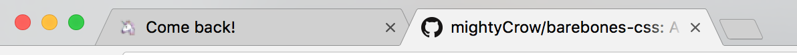

<p align="center">
	
</p>
<br>
<div align="center">
	Do the old favicon switcheroo
</div>
<br>
<div align="center">
	<a href="https://badge.fury.io/gh/tiaanduplessis%2Fdont-go">
    
  </a>
	<a href="https://badge.fury.io/js/dont-go">
    
  </a>
	<a href="https://badge.fury.io/bo/dont-go">
    
  </a>
	<a href="https://travis-ci.org/tiaanduplessis/dont-go">
    
  </a>
	<a href="https://npmjs.org/package/dont-go">
    
  </a>
  <a href="http://packagequality.com/#?package=dont-go">
    
  </a>
</div>
<br>
<div align="center">
  Built with ❤︎ by <a href="http://tiaanduplessis.co.za/">Tiaan du Plessis</a> and <a href="https://github.com/tiaanduplessis/wenk/graphs/contributors">contributors</a>
</div>

<h2>Table of Contents</h2>
<details>
  <summary>Table of Contents</summary>
	<li><a href="#about">about</a></li>
  <li><a href="#install">Install</a></li>
  <li><a href="#usage">Usage</a></li>
  <li><a href="#demo">Demo</a></li>
	<li><a href="#examples">Examples</a></li>
  <li><a href="#contributing">Contributing</a></li>
  <li><a href="#license">License</a></li>
</details>

## About

<div align="center" width="50%">
	
</div>

Dont-go is a small client-side library with zero dependencies to change the title and/or favicon of the page when it is inactive. Minified version weighs in at a [whopping](http://www.dictionary.com/browse/whopping) **1.47 kB** when minified. Note that **You must include a default favicon in your webpage**.

## Install

**Install with cdn**

```html
<script src="https://cdn.rawgit.com/tiaanduplessis/dont-go/master/lib/dont-go.js"></script>
<!-- Or -->
<script src="https://unpkg.com/dont-go/lib/dont-go.js"></script>
```

**Install with Bower**
```sh
$ bower install dont-go
```

**Install with npm**

```sh
$ npm install dont-go
```

**Install with yarn**

```sh
$ yarn add dont-go
```

## Usage

<p align="center">
	
</p>

To use, simply call the function with options.
```js

dontGo({
	title: 'Alternative title text right here!',
	faviconSrc: 'path/to/Alternative/favicon.ico',
	timeout: 5000 //5 seconds
});

```

The `faviconSrc` property is optional and will keep the same icon if not set.

The `timeout` property is optional, it takes an interval in milliseconds to before title & favicon change.

It is also possible to set the title property to an array of values and set an interval to switch between them as seen in the example below;
```js

dontGo({
	title: ['Alternative title text', 'Another alternative title'],
	faviconSrc: 'path/to/Alternative/favicon.ico',
	interval: 1000 //1 second
});

```

## Demo

Check out [the demo](https://tiaanduplessis.github.io/dont-go/) here.

## Examples

Please see the example directory for more usage examples.

## Contributing

All Contributions are welcome! Please open up an issue if you would like to help out. :smile:

## License

Licensed under the [MIT License](https://tiaan.mit-license.org/).

Icons made by <a href="http://www.flaticon.com/authors/madebyoliver" title="Madebyoliver">Madebyoliver</a> from <a href="http://www.flaticon.com" title="Flaticon">www.flaticon.com</a> is licensed by <a href="http://creativecommons.org/licenses/by/3.0/" title="Creative Commons BY 3.0" target="_blank">CC 3.0 BY</a>.
