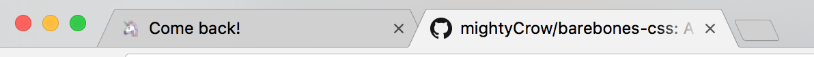

<p align="center">
	
</p>
<br>
<div align="center">
	Change the title and favicon while your page is inactive
</div>
<br>
<div align="center">
	<a href="https://badge.fury.io/gh/tiaanduplessis%2Fdont-go">
    
  </a>
  <a href="https://greenkeeper.io/">
    
  </a>
	<a href="https://badge.fury.io/js/dont-go">
    
  </a>
	<a href="https://travis-ci.org/tiaanduplessis/dont-go">
    
  </a>
	<a href="https://npmjs.org/package/dont-go">
    
  </a>
  <a href="http://packagequality.com/#?package=dont-go">
    
  </a>
</div>

## Table of Contents

- [About](#about)
- [As Seen In](#as-seen-in)
- [Install](#install)
- [Usage](#usage)
- [Demo](#demo)
- [Examples](#examples)
- [Contributing](#contributing)
- [license](#license)

## About

<div align="center" width="50%">
	
</div>

Dont-go is a small client-side library with zero dependencies to change the title and/or favicon of the page when it is inactive. Include a default favicon in your webpage to enable favicon changes. Pages without one can still use title changes.

## As Seen In

- [This Clever Trick Brings Visitors Back When They Tab Away](https://www.hongkiat.com/blog/dont-go-favicon-title/)

## Install

**Install with cdn**

```html
<script src="https://unpkg.com/dont-go@1.1.1/lib/dont-go.umd.js"></script>
```

Load this script before calling `window.dontGo(...)`. The UMD bundle exposes the browser global; `lib/dont-go.js` is the CommonJS entry for module loaders.

The CDN example is pinned to the published 1.1.1 release. This README also describes unreleased changes on `master`: support for pages without a favicon, favicon arrays, cleanup functions, and improved lifecycle handling. These need a new release before they are available from npm or the CDN.

**Install with npm**

```sh
$ npm install dont-go
```

**Install with yarn**

```sh
$ yarn add dont-go
```

## Usage

<p align="center">
	
</p>

To use, simply call the function with options.
```js

dontGo({
	title: 'Alternative title text right here!',
	faviconSrc: 'path/to/Alternative/favicon.ico',
	timeout: 5000 //5 seconds
});

```

The `faviconSrc` property is optional and will keep the same icon if not set. It accepts a single URL or an array of URLs.

The `timeout` property is optional. It delays the first title and favicon change by the given number of milliseconds.

Set `title`, `faviconSrc`, or both to arrays to rotate through their values. Both advance on the same `interval` (1000 milliseconds by default), wrapping independently if their lengths differ. The first values appear as soon as the page becomes hidden, or after `timeout` if set:
```js

dontGo({
	title: ['Alternative title text', 'Another alternative title'],
	faviconSrc: ['path/to/Alternative/favicon.ico', 'path/to/Alternative/favicon2.ico'],
	interval: 1000 //1 second
});

```

Returning to the page cancels pending changes and restores the original title and favicon. The next hidden period starts at the first values again. Empty arrays leave that property unchanged, and non-string entries are ignored. An empty favicon URL is ignored. Changes follow the Page Visibility API; focus or blur alone does not trigger them.

Calling `dontGo` again replaces the previous configuration. It also returns a cleanup function for use when unmounting a component or stopping the effect:

```js
const stop = dontGo({ faviconSrc: ['one.ico', 'two.ico'] });
// Restore the originals and remove the visibility listener and timers.
stop();
```

## Demo

Check out [the demo](https://tiaanduplessis.github.io/dont-go/) here.

## Examples

Please see the example directory for more usage examples.

## Contributing

Run `npm test` for lint, DOM regression tests, and an offline plain-script UMD smoke test (Node.js 18 or newer), then `npm run build` to regenerate the CommonJS, ES module, and UMD bundles. Rerun `npm test` after building to check the generated UMD bundle.

All Contributions are welcome! Please open up an issue if you would like to help out. :smile:

## License

Licensed under the [MIT License](https://tiaan.mit-license.org/).

Icons made by <a href="http://www.flaticon.com/authors/madebyoliver" title="Madebyoliver">Madebyoliver</a> from <a href="http://www.flaticon.com" title="Flaticon">www.flaticon.com</a> is licensed by <a href="http://creativecommons.org/licenses/by/3.0/" title="Creative Commons BY 3.0" target="_blank">CC 3.0 BY</a>.
